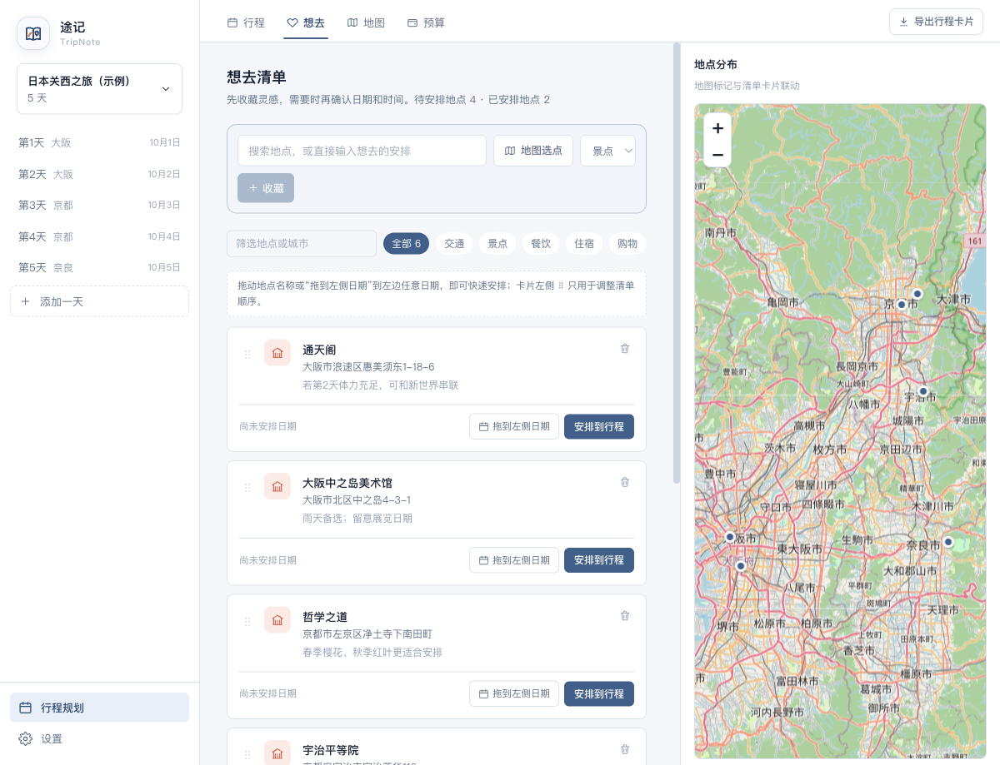
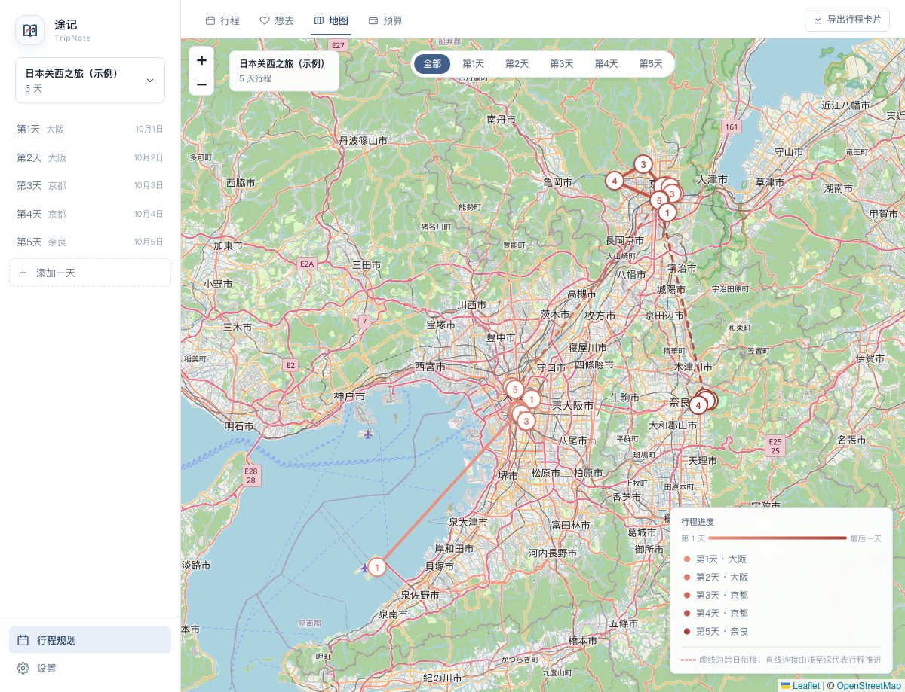

# 途记 TripNote

> 一个本地优先的旅行规划工具，把「想去的地方、每天的安排、地图路线和预算」放在同一个轻量工作台里。

途记适合在出发前做旅行规划，也适合旅途中打开手机快速查阅。它不需要注册账号；默认情况下，所有行程数据只保存在你当前浏览器中。

## 界面预览

以下截图均来自内置的「日本关西之旅（示例）」行程。

### 时间轴与当天地图


### 想去清单与地点分布



### 全程地图



## 功能

- **多旅行管理**：新建、切换和管理不同旅行；内置一份可随时删除的关西示例行程。
- **灵活日期编排**：在首页增添、插入、删除天数；修改任意一天日期时，后续日期可自动顺延。
- **时间轴行程**：按时间记录交通、景点、餐饮、住宿和购物，补充地点、时长、备注与多笔花费。
- **想去清单**：先收藏地点再安排日期；支持拖拽排序，并可直接拖到桌面端左侧日期列表完成安排。同一地点可安排到多天。
- **地图与选点**：在地图上查看地点和行程连线；搜索不到地点时，可直接在地图上选点并命名。
- **预算汇总**：自动按行程条目聚合花费，查看全程和每日预算。
- **行程卡片导出**：将完整行程导出为一张适合手机查看、转发和保存的长图。
- **可选高德服务**：默认使用 OpenStreetMap / Nominatim；在设置中填入自己的高德 JS Key 与 Web 服务 Key 后，可切换到高德地图和地点搜索。密钥不会写入代码或上传到服务器。
- **PWA 安装**：部署到 HTTPS 地址后，可从浏览器安装到电脑和手机桌面，像普通应用一样使用。
- **数据备份**：可在设置页导出和导入行程数据，便于换设备或手动备份。

## 数据与隐私

TripNote 是一个纯前端、本地优先的应用：

- 行程数据、设置和可选的高德密钥默认存储在**当前浏览器**中。
- 部署到 NAS、静态网站或服务器不会让不同用户共享行程；每台设备、每个浏览器各有独立数据。
- 清除该站点的浏览器数据会删除本地行程，建议定期使用设置页的导出功能备份。
- 地点搜索、底图和路线功能需要请求对应的地图服务；未配置高德时会自动回退到免费方案。

## 快速开始

需要 Node.js 22 或更高版本。

```bash
git clone https://github.com/mfcheer/TripNote.git
cd trip-app
npm install
npm run dev
```

打开终端显示的地址（默认是 `http://localhost:5173`）即可使用。

生产构建：

```bash
npm run build
npm run preview
```

代码检查：

```bash
npm run lint
```

## Docker / NAS 部署

仓库已提供 `Dockerfile` 与 `compose.yaml`。在 `trip-app` 目录运行：

```bash
docker compose up -d --build
```

默认访问地址为：

```text
http://NAS_IP:8080
```

如果 `8080` 已被占用，请修改 `compose.yaml` 中 `8080:80` 左侧的端口。极空间等 NAS 可直接在 Docker Compose 页面选择本目录并部署。

### 分享给朋友与 PWA 安装

如需让朋友从手机安装，建议为 NAS 配置一个固定的 HTTPS 域名，再将请求反向代理至 `http://127.0.0.1:8080`。也可以使用 Cloudflare Tunnel，避免直接暴露 NAS 端口。

访问该 HTTPS 地址后：

- **iPhone / iPad**：使用 Safari 打开，点“分享” → “添加到主屏幕”。
- **Android**：在 Chrome 菜单选择“安装应用”或“添加到主屏幕”。
- **桌面端**：Chrome、Edge 的地址栏或浏览器菜单中选择“安装应用”。

> `http://NAS_IP:8080` 与 `https://你的域名` 会被浏览器视为两个不同站点，各自拥有独立的本地数据。确定分享地址后，请始终使用同一个地址访问。

## 高德地图（可选）

不配置高德也能使用应用。若希望获得更适合国内地点的地图与搜索体验：

1. 前往[高德开放平台](https://lbs.amap.com/)创建应用和 Key。
2. 在 TripNote 的“设置 → 高德地图（可选）”中填入 JS API Key 与 Web 服务 Key。
3. 保存后选择高德地图；随时清空密钥即可恢复默认方案。

已有行程地点会保持兼容：应用内部统一保存标准经纬度，切换地图服务不会丢失之前的地点信息。

路线展示也可在设置中选择直线连接或步行路线；直线连接不额外消耗路线 API 配额。

## macOS 桌面版

项目包含 Tauri 桌面壳，可在 macOS 上构建 DMG：

```bash
npm install
npm run desktop:build
```

生成文件位于 `src-tauri/target/release/bundle/dmg/`。构建产物默认适配当前 Mac 的芯片架构；若需面向 Intel Mac，请在 Intel Mac 上构建或另行生成通用版本。

未签名的本地构建首次打开时，macOS 可能要求用户在“隐私与安全性”中确认。正式分发需要使用 Apple Developer 证书签名并公证。

## 技术栈

- React + TypeScript + Vite
- Zustand（本地状态持久化）
- Leaflet / React Leaflet（默认地图）
- 高德地图 JavaScript API 与 Web 服务 API（可选）
- dnd-kit（拖拽排序与安排）
- Recharts（预算可视化）
- PWA Service Worker
- Tauri（macOS 桌面端）

## 项目结构

```text
trip-app/
├── src/
│   ├── components/    # 页面与交互组件
│   ├── api/           # 地图、地点搜索与路线服务
│   ├── data/          # 示例行程数据
│   ├── utils/         # 图片导出等工具
│   └── store.ts       # 本地数据与业务状态
├── public/            # PWA 图标、清单和 Service Worker
├── src-tauri/         # macOS 桌面端配置
├── Dockerfile
└── compose.yaml
```

## 开源前检查清单

- 确认不要提交个人行程数据、私钥、域名或 NAS 配置。
- 建议补充 `LICENSE` 文件后再公开发布。
- 若配置了高德密钥，请只在自己的浏览器设置中填写，不要写入仓库或截图。
